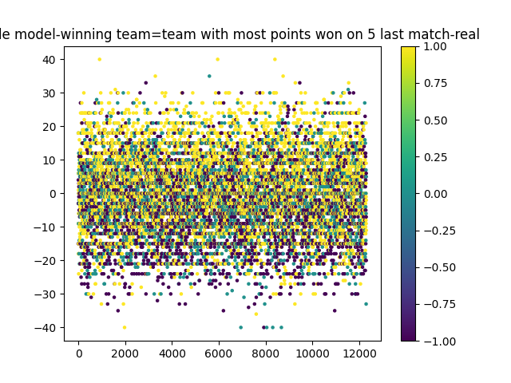
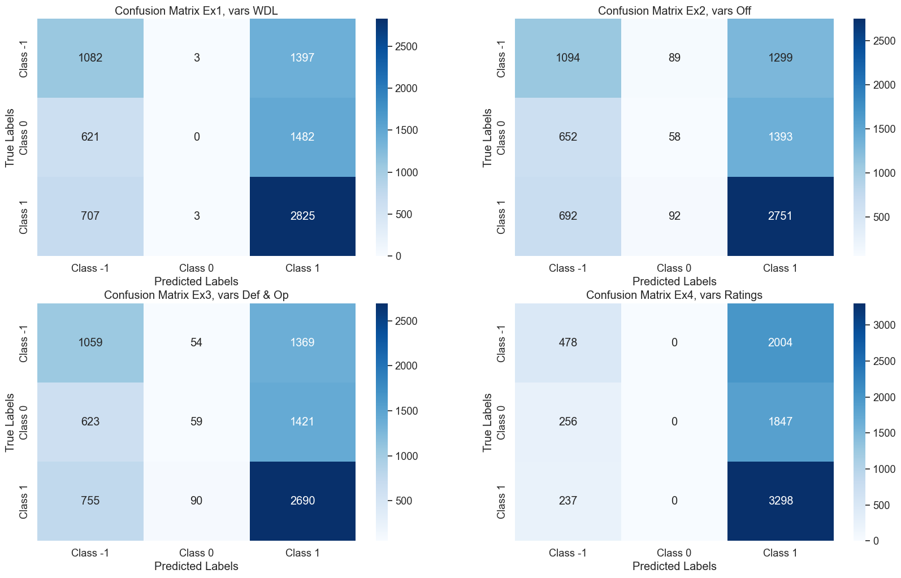
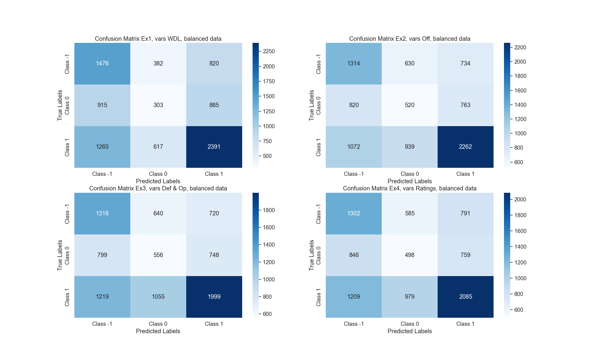
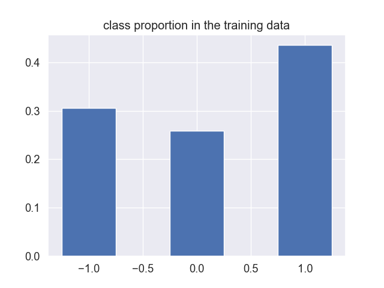
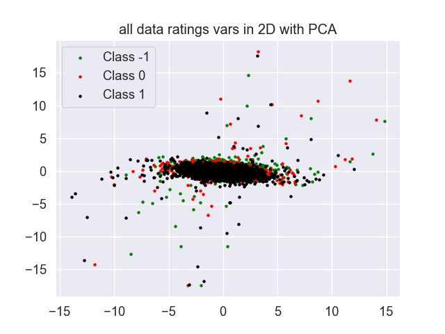
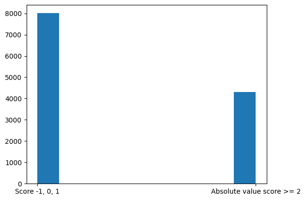

  -----------------------------------------------------------------------
  Football Match Outcome Prediction
  -----------------------------------------------------------------------

  -----------------------------------------------------------------------

+-----------------------------------+-----------------------------------+
| MVA 2023/2024: Challenge Data QRT |                                   |
+===================================+===================================+
| Akedjou Achraff Adjileye          | > Jordan Momo Jupou               |
+-----------------------------------+-----------------------------------+

1/15

+-----------------------------------------------------------------------+
| > Introduction                                                        |
+=======================================================================+
+-----------------------------------------------------------------------+

> *•* Aim: Predict football match outcomes.
>
> *•* Target: 3 classes classification problem: win (1), draw (0),
>
> loss (-1)
>
> *•* Utilized datasets: Team and player statistics.

2/15

+-----------------------------------------------------------------------+
| > Description and Remarks on the Dataset                              |
+=======================================================================+
+-----------------------------------------------------------------------+

> *•* Important: Match samples consist of home and away team
>
> statistics.

+-----------------------------------+-----------------------------------+
| *•* Missing data observed.        | +--------------+--------------+   |
|                                   | | > Stats      | > \%         |   |
| {width="1.9138877952755906in" | | > Inside     | > 11.27      |   |
| height="1.4347222222222222in"}    | | > Box\       | > 11.49      |   |
|                                   | | > Shots      | > 11.25      |   |
|                                   | | > Outside    | > 15.93      |   |
|                                   | | > Box        |              |   |
|                                   | | > Passes\    |              |   |
|                                   | | > Successful |              |   |
|                                   | | > Passes     |              |   |
|                                   | | > Injuries   |              |   |
|                                   | +--------------+--------------+   |
+===================================+===================================+
+-----------------------------------+-----------------------------------+

3/15

+-----------------------------------------------------------------------+
| > Baseline Method                                                     |
+=======================================================================+
+-----------------------------------------------------------------------+

> *•* Baseline: Simple heuristic based on recent team performance.*•*
> **Number of points** (*Np*): *Np* = 3 *× Nw* + 1 *× Nd* + 0 *× Nl*.*•*
> Achieved accuracy: 42%.

{width="2.551388888888889in"
height="1.913888888888889in"}

4/15

+-----------------------------------------------------------------------+
| > Advanced Methods                                                    |
+=======================================================================+
+-----------------------------------------------------------------------+

> *•* Logistic regression on WDL features.
>
> *•* Logistic regression on offensive features.
>
> *•* Logistic regression on defensive and open play features.*•* Search
> for more discriminative features : players rating

+-----------------------------------+-----------------------------------+
| > Features                        | Accuracy(%)                       |
+===================================+===================================+
| > WDL features                    | > 48.02                           |
+-----------------------------------+-----------------------------------+
| > Offensives features             | > 48.42                           |
+-----------------------------------+-----------------------------------+
| Defensives & Open play features   | > 47.25                           |
+-----------------------------------+-----------------------------------+
| > Ratings features                | > 46.70                           |
+-----------------------------------+-----------------------------------+
| > MoE                             | > 49.05                           |
+-----------------------------------+-----------------------------------+

5/15

+-----------------------------------------------------------------------+
| > Error Analysis: Summary                                             |
+=======================================================================+
+-----------------------------------------------------------------------+

> *•* Models face difficulty in detecting draw matches due to imbalanced
> data, favoring majority classes.
>
> *•* Projection on 2D PCA(80% of explained variance) shows that
> features lack of discrimination

  --------------------------------------------------------------------------------------------------------------------------------------------------------------------------------------------
  {width="1.9138877952755906in"   {width="1.913888888888889in"
  height="1.2277777777777779in"}                                                                 height="1.4347222222222222in"}
  ---------------------------------------------------------------------------------------------- ---------------------------------------------------------------------------------------------

  --------------------------------------------------------------------------------------------------------------------------------------------------------------------------------------------

6/15

+-----------------------------------------------------------------------+
| > Attempt to fix the issue by balancing the training split            |
+=======================================================================+
+-----------------------------------------------------------------------+

> *•* Train the model on the balanced data allows it to detect more
>
> draw matches at the cost of a drop in accuracy
>
> *•* Classes are unbalanced in test split

Table: Summary of Test Performance Drops

+-----------------------+-----------------------+-----------------------+
| > Feature Set         | Train(%)              | Val(%)                |
+=======================+=======================+=======================+
| > WDL\                | > 44.69\              | > 45.24 46.05 42.78   |
| > Offensive\          | > 42.90\              |                       |
| > Defensive + Open    | > 45.98               |                       |
| > Play                |                       |                       |
+-----------------------+-----------------------+-----------------------+

7/15

+-----------------------------------------------------------------------+
| > Attempt to fix the issue by balancing the training split            |
+=======================================================================+
+-----------------------------------------------------------------------+

{width="1.7in"
height="1.0208333333333333in"}

{width="1.7in"
height="1.275in"}

8/15

+-----------------------------------------------------------------------+
| > Data Transformation to Enhance Feature Discrimination               |
+=======================================================================+
+-----------------------------------------------------------------------+

> *•* Kernel Method: Support Vector Classification (SVC).
>
> *•* Grid search was performed on the training data, with WDL features
> reduced to three dimensions by PCA, retaining **90%** of the variance.
>
> *•* Same conclusion: features are sufficiently discriminative as the
> best model obtained underperforms logistic\
> regression:**47.9310%**

+-----------------------------------+-----------------------------------+
| Params name (as in sklearn)       | Values                            |
+===================================+===================================+
| > C\                              | \[0.1, 1, 10, 100\]\              |
| > gamma\                          | \[0.1, 0.01, 0.001\]\             |
| > kernel\                         | \[rbf, linear, poly, sigmoid\]\   |
| > best model\                     | C: 10, gamma: 0.1, kernel: rbf    |
| > validation score                | **47.7586%**                      |
+-----------------------------------+-----------------------------------+

9/15

+-----------------------------------------------------------------------+
| > Search for More Discriminative Features in the Players              |
+=======================================================================+
+-----------------------------------------------------------------------+

+-----------------------------------------------------------------------+
| > Dataset                                                             |
+=======================================================================+
+-----------------------------------------------------------------------+

> *•* Most player variables have equivalents for teams.
>
> *•* Team's success isn't solely determined by individual player
> performance.
>
> *•* Ratings are potentially decisive variables for predicting match
> winners.
>
> *•* **Ratings Variables**: Player Rating season average, Player Rating
> season std, Player Rating 5 last match average, Player
>
> Rating 5 last match std
>
> *•* **Players Aggregation**: average ratings of top 11 players*•*
> **Logistic regression performance**\
> *•* Training: 46.3064%\
> *•* Validation: 46.6995%

10/15

+-----------------------------------------------------------------------+
| > Search for More Discriminative Features in the Players              |
+=======================================================================+
+-----------------------------------------------------------------------+

+-----------------------------------------------------------------------+
| > Dataset                                                             |
+=======================================================================+
+-----------------------------------------------------------------------+

> *•* Projection rating features in 2D PCA: 83% of explained variance
>
> *•* Finally even the ratings features are not enough discriminative

{width="2.126388888888889in"
height="1.5944433508311462in"}

11/15

+-----------------------------------------------------------------------+
| > Goal Difference Target For Understanding Models                     |
+=======================================================================+
+-----------------------------------------------------------------------+

+-----------------------------------------------------------------------+
| > Limitation                                                          |
+=======================================================================+
+-----------------------------------------------------------------------+

> *•* Majority of matches are won by 1 goal difference making more
> difficult the distinction between a draw(0) and a
>
> win(1)/lost(-1)
>
> *•* The difficulty is enhanced by the dominance of the classes 1 and
> -1 in the dataset

{width="2.125in"
height="1.3930555555555555in"}

12/15

+-----------------------------------------------------------------------+
| > Final Model: Expert Aggregation                                     |
+=======================================================================+
+-----------------------------------------------------------------------+

> *•* Mixture of experts (MoE) from four models.
>
> *•* Majority voting.
>
> *•* Achieved accuracy: 49.05%, +0.5% than best expert.

+-----------------------------------+-----------------------------------+
| > Features                        | Accuracy(%)                       |
+===================================+===================================+
| > WDL features                    | > 48.02                           |
+-----------------------------------+-----------------------------------+
| > Offensives features             | > 48.42                           |
+-----------------------------------+-----------------------------------+
| Defensives & Open play features   | > 47.25                           |
+-----------------------------------+-----------------------------------+
| > Ratings features                | > 46.70                           |
+-----------------------------------+-----------------------------------+
| > MoE                             | > 49.05                           |
+-----------------------------------+-----------------------------------+

13/15

+-----------------------------------------------------------------------+
| > Future Works                                                        |
+=======================================================================+
+-----------------------------------------------------------------------+

> *•* More handcrafted Feature engineering
>
> *•* Combine balanced and unbalanced models in a MoE
>
> algorithm.
>
> *•* Use deep learning models

14/15

> **Thank you for you attention**\
> **Allez les bleus**

{width="2.125in"
height="1.1958333333333333in"}

15/15
